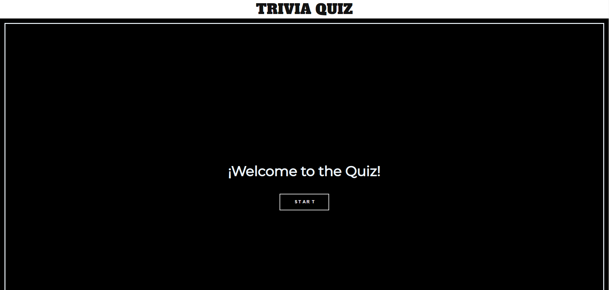
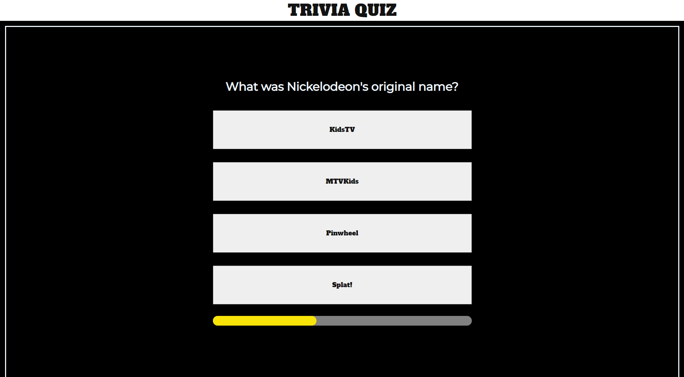
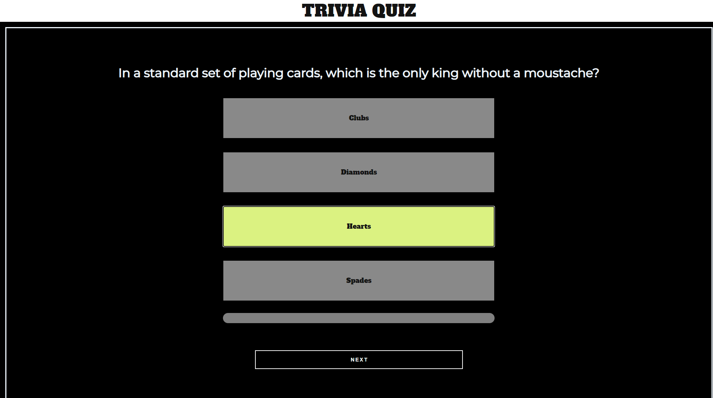

  <a href="https://github.com/othneildrew/Best-README-Template">
    
 
  <h3 align="center">Proyecto SPA Quiz</h3>

   
   

  
https://spa-trivial.netlify.app/
  

  <ol>
    <li>
      <a href="#sobre-el-proyecto">Sobre el proyecto</a>
      <ul>
        <li><a href="#herramientas-utilizadas">Herramientas utilizadas</a></li>
      </ul>
    </li>
    <li>
      <a href="#empezando">Empezando</a>
      <ul>
        <li><a href="#guía-de-uso">Guía de uso</a></li>
      </ul>
    </li>
    <li><a href="#contacto">Contacto</a></li>   
  </ol>

 

<!-- SOBRE EL PROYECTO -->
## Sobre el proyecto

El proyecto consiste en crear una single page application en la que mostraremos un Quiz.

Características:
* El Quiz constará de 10 preguntas. Cada pregunta tendrá 4 opciones y solo una de ellas será la correcta.
* Deberán ser preguntas que vengan de https://opentdb.com/ u otras API´s.
* La Aplicación tendrá que ser una SPA(single-page-application). Solo una pregunta cada vez en pantalla.

  

### Herramientas utilizadas

 

Esta sección incluye el lenguaje de etiquetado,maquetación y programación empleado

* [HTML](https://html.com/)
* [CSS](https://www.w3schools.com/css/)
* [Javascript](https://www.javascript.com/)

  

<!--COMIENZO JAVASCRIPT-->

## GUÍA DE USO

  

Pantalla de inicio del programa

  

Una vez pulsado el botón Start se muestra la primera pregunta y cuatro botones con las posibles respuestas. Debajo de las mismas hay una barra de progreso.

  

Una vez pulsado uno de los botones se marcará en amarillo la respuesta correcta y las incorrectas temblarán y se oscurecerán. Tras esto aparecerá un botón "Next" que nos llevará a la siguiente pregunta.

  
 
 Una vez acabado el Quiz se mostará la puntuación obtenida. Se nos dará opción de volver a empezar o de mostrar una gráfica con el historial de aciertos de todas las partidas acumuladas.

  

La gráfica mostrará el número de acierto pro partidas jugadas.

 

 ### Retos superados 

- [x] Estructura básica HTML
- [x] Añadido barra de navegación
- [x] Contenedores preguntas y respuestas
- [x] FlexBox
- [x] Diseño Responsivo
- [x] Stats chart in home
- [x] Barra de progreso
- [x] Uso de local storage
- [x] Petición de datos a Api´s 
- [x] Randomizar respuestas
- [x] Gestión de falsos clicks
- [x] Gestión de puntuación
- [x] Implementación de gráficas
- [x] Para guardar contadores
- [x] Control de asincronías
- [x] Modal inferior
- [x] Gestión de caracteres 
- [x] Destructuración de funciones
- [x] Refactorización de código
- [x] Implementación de sonidos por puntuación

 

<!-- CONTACTO -->
## Contacto

- [Jorge](mailto:jcampo1982.@outlook.com "Contact me")

- [Germán](mailto:moltorger@gmail.com "Hi!")

## Autores

Jorge Campo

Germán Molero

- [GitHub Jorge](https://github.com/Yorch82 "Jorge Campo")

- [GitHub Germán](https://github.com/Molerog "Germán Molero")

