

  <a href="https://github.com/othneildrew/Best-README-Template">
    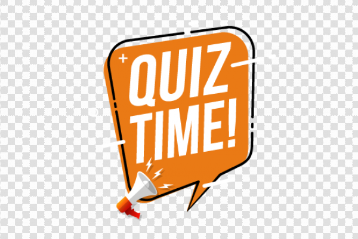

  <h3 align="center">Proyecto SPA Quiz</h3>

   
   

  
Tabla de contenidos

  <ol>
    <li>
      <a href="#sobre-el-proyecto">Sobre el proyecto</a>
      <ul>
        <li><a href="#herramientas-utilizadas">Herramientas utilizadas</a></li>
      </ul>
    </li>
    <li>
      <a href="#empezando">Empezando</a>
      <ul>
        <li><a href="#html">HTML</a></li>
        <li><a href="#css">CSS</a></li>
        <li><a href="#javascript">JAVASCRIPT</a></li>
      </ul>
    </li>
    <li><a href="#contacto">Contacto</a></li>   
  </ol>

 

<!-- SOBRE EL PROYECTO -->
## Sobre-el-proyecto

[![Product Name Screen Shot][product-screenshot]](https://example.com)

El proyecto consiste en crear una single page application en la que mostraremos un Quiz.

Características:
* El Quiz constará de 10 preguntas. Cada pregunta tendrá 4 opciones y solo una de ellas será la correcta.
* Deberán ser preguntas que vengan de https://opentdb.com/ u otras API´s.
* La Aplicación tendrá que ser una SPA(single-page-application). Solo una pregunta cada vez en pantalla.

   

(<a href="#top">back to top</a>)

### Herramientas utilizadas

 

Esta sección incluye el lenguaje de etiquetado,maquetación y programación empleado

* [HTML](https://html.com/)
* [CSS](https://www.w3schools.com/css/)
* [Javascript](https://www.javascript.com/)

* [Bootstrap](https://getbootstrap.com)

   

<!-- EMPEZANDO -->
## Empezando

 

A continuación iremos describiendo desde el principio paso a paso el proceso de creación del Quiz. Para ello dividiremos en secciones este apartado explicando desde el archivo HTML, como el CSS y Javascript

  

<!-- COMIENZO HTML -->
## HTML

 

Primero creamos el documento HTML y añadimos la librería de Bootstrap para poder utilizar una de sus muchas NavBar.

 
<!--NAVBAR-->
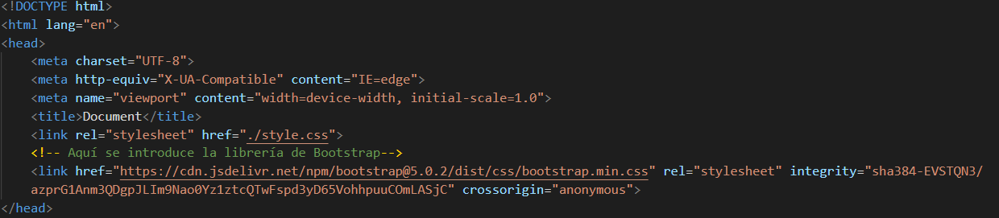

  

A continuación añadimos una NavBar de Boostrap y alineamos el elemento Trivia Quiz con un justify-content-center
<!--WELCOME-->
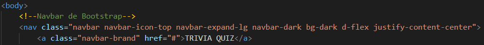

  

Empezamos a plantear la disposición de los elementos. 

Primero creamos un contenedor principal en el que irán entrando el resto de contenedores ya que de esta manera, aplicando flex-box al contenedor principal, conseguimos facilitar la tarea de maquetación

El primer container que aparecerá al cargar la página es el de Bienvenida, en el cual colocamos el botón "Start" para poder comenzar el Quiz

<!--PREGUNTAS-->
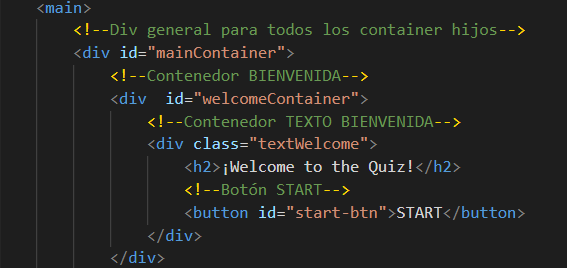

  

Al pulsar el botón "Start" el siguiente contenedor que se muestra es el del cuestionario. Este contendrá las 10 preguntas que irán apareciendo conforme se contesten y se pulse sobre el botón "Next", incluído también en este contenedor. Este contenedor es el más importante puesto que ese el que contendrá más lógica de programación. Al contenedor se le añade la clase "hide" para, desde CSS y Javascript, ir configurando el "display" del contenedor cuando sea necesario. 

Dentro de este mismo contenedor crearemos otro llamado "questionPrint" en el que iremos añadiendo las preguntas y los botones de respuesta de forma dinámica con Javascript.

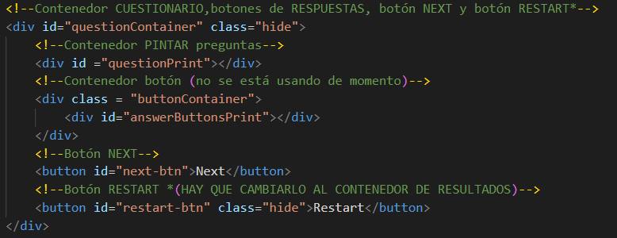

  

A continuación crearemos el contenedor que mostrará una puntuación final dependiendo de las respuestas acertadas.

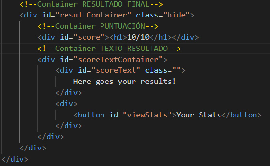

  

<!--COMIENZO CSS-->

## CSS

 
Aquí activamos los elementos con clase "hide" para poder manipularlos en Javascript. Del mismo modo añadimos las clases con nombres diferenciados para, en Javascript, crear los botones con las distintas respuestas de manera dinámica y diferenciar, gracias a las clases, qué botones deben marcarse en rojo (respuesta equivocada) y cuál en verde (respuesta acertada)

 

<!--COMIENZO JAVASCRIPT-->

## JAVASCRIPT

  
Aquí atacamos a los elementos que nos interesa manipular desde Javascript a través del "Document Object Model". Todos los elementos seleccionados por ID serán guardados en unas constantes que iremos utilizando a lo largo del programa.

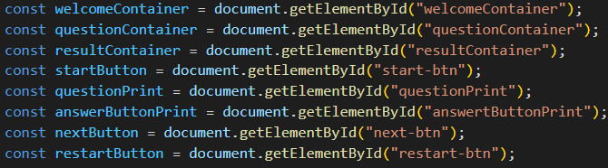

  

Declaramos una variable que actuará como contador; no la inicializamos todavía. Más adelante explicaremos el proposito de este contador.

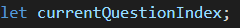

  

Vamos a comenzar la serie de procesos que harán de nuestra página una SPA:

"start.Button" apunta directamente al elemento botón del container de Bienvenida a través del DOM. A este botón le aplicamos un .addEventListener para que haga dos cosas: Reaccionar al "click" del ratón y gracias a esto poner en marcha la función "startGame()"

  

Creamos la función startGame sin ningún parámetro puesto que no tiene que gestionar ningún tipo de dato externo a la propia función. Cuando se ejecute esta función a través del "click" del evento, el container que da la bienvenida se esconderá gracias a la propiedad ".classList.add()". El contador declarado anteriormente será inicializado a 0 y se mostrará la "questionContainer" esta vez gracias a la propiedad "classList.remove()". Por último se hará una invocación a la función "setNextQuestion()".

  
Esta función tendrá dos objetivos:  
   * 1. Esconder el botón "Next" y borrar las respuestas contestadas una vez se pulse gracias a la función "resetState()" 
   * 2. Pintar la siguiente pregunta si la hubiera con la función"showQuestion()" teniendo que recibir como parámetro la posición index del objeto que contiene las preguntas.

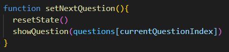

 

 *  resetState

Como indicamos previamente, lo primero que hará esta función es esconder el botón "next" puesto que lo que buscamos es que se responda a las preguntas antes de poder pasar a la siguiente.

El ciclo while se coloca para que el primer hijo del contenedor "questionPrint" sea siempre eliminado. Al darle al botón "Start" este ciclo no hará nada puesto que todavía no se habrá pintado nada sobre este contenedor. 

"questionPrint.removeChild()" ordena al elemento eliminar a sus descendientes. Entre paréntesis se especificará a qué descendiente en concreto, que en este caso será al primer descendiente: "(questionPirnt.firstChild)"

Esta función que se aplicará también al pulsar el botón "Next"

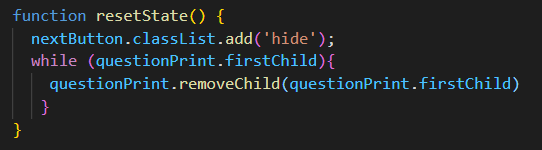

  

* showQuestion

La función recibirá como parametro (llamnado "question") la posición index del objeto que contiene las preguntas y las respuestas. El parámetro lo recoje a través de la invocación ya mencionada dentro de la función setNextQuestion.

Lo que se indica después es la pregunta que tiene que aparecer; como el parámetro indica la posición del objeto simplemente tenemos que indicar a Javascript dónde queremos que se pinte la pregunta, en este caso, a través del DOM, en "questionPrint"; le indicamos el texto que tiene que contener indicándole que este se encuentra en el objeto que hemos pasado como parámetro y a la propiedad de este llamada "question" quedando así: "question.question".

Como hay más de una respuesta debemos crear un forEach para que recorra todas las posibles respuesta. Accedemos a esa propiedad utilizando "question.answers". Dentro del forEach creamos varias tareas que el programa debe realizar en cada iteración:

* 1.Crear una constante button para utilizarla más adelante.
* 2.Creamos el elemento button dinámicamente con la propiedad "document.createElement()". Entre paréntesis escribimos la etiqueta del elemento para crearla.
* 3.El botón contendrá un texto que será igual al texto contenido dentro de la propiedad "answer".
* 4.Al botón se le añadirá también una clase llamada "btn" que utilizaremos para colorear los botones con la respuesta equivocada y el botón con la respuesta correcta.
* 5.Se creara una condición en la que se detectará qué respuesta es la correcta. Para ello el objeto que contiene las preguntas hay que añadirle una propiedad "correct" con el valor "true". Al pasar la condición dejaremos una marca en esa respuesta con la propiedad "dataset.correct" para acceder a ella más adelante.
* 6.A los botones se les añadirá un evento que acepta como parámetro el evento "click" y una función llamada "selectAnswer" que comentaremos a continuación
* 7.Se pintarán botones en cantidad igual al número de respuestas. Para pintar los botones se indica el lugar "questionPrint", el método "appendChild" y lo que queremos pintar "(button)".

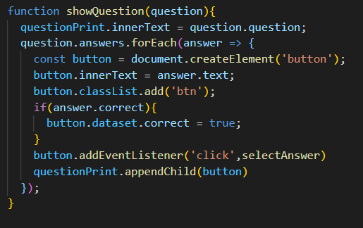

  

Ahora tenemos que ver qué ocurre cuando pulsamos los bótones de respuestas.

Lo primero que hará el programa es introducir todas los botones con las respuestas en un array. Después con un forEach realizará una iteración por esas respuestas y aplicará la función "setStatusClass" recibiendo como parámetro todos los botones con las respuestas y el botón con la respuesta correcta que marcamos en la función anterior.

Por último aplicará una condición donde comparará la longitud de las preguntas que hay dentro del objeto con el contador que creamos al principio del programa. Si la cantidad de preguntas es mayor a la del contador el botón Next reaparecerá y el programa reiniciará todo el proceso desde la función "resetState" con una nueva pregunta y nuevas respuestas.

Si resultara que el contador alcanzó la longitud de las preguntas aparecerá el botón "restart" para reiniciar el Quiz.

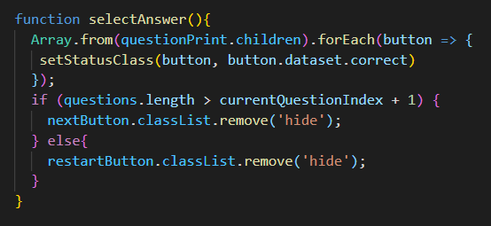

  

Esta función añadirá una clase al botón de respuesta (preparada con anterioridad en CSS); en el momento que se pulse cualquier botón de respuesta. La función filtrará las respuestas y dejará pasar a la respuesta que fue marcada con "true" añadiendo a esta la clase "correct" que la pintará de verde en el momento. 

El resto de respuestas al no pasar el filtro (porque son "false") se les añadriá la clase "wrong" y serán pintadas de rojo.

<!-- CONTACTO -->
## Contacto

Your Name - [@your_twitter](https://twitter.com/your_username) - email@example.com

Project Link: [https://github.com/your_username/repo_name](https://github.com/your_username/repo_name)

(<a href="#top">back to top</a>)

## Autores

Yorch

Germán Molero

- [Profile](https://github.com/Molerog "Germán Molero")

- [Profile](https://github.com/vaneebg "Vanesa Beltrán")

- [Email](mailto:moltorger@gmail.com "Hi!")

